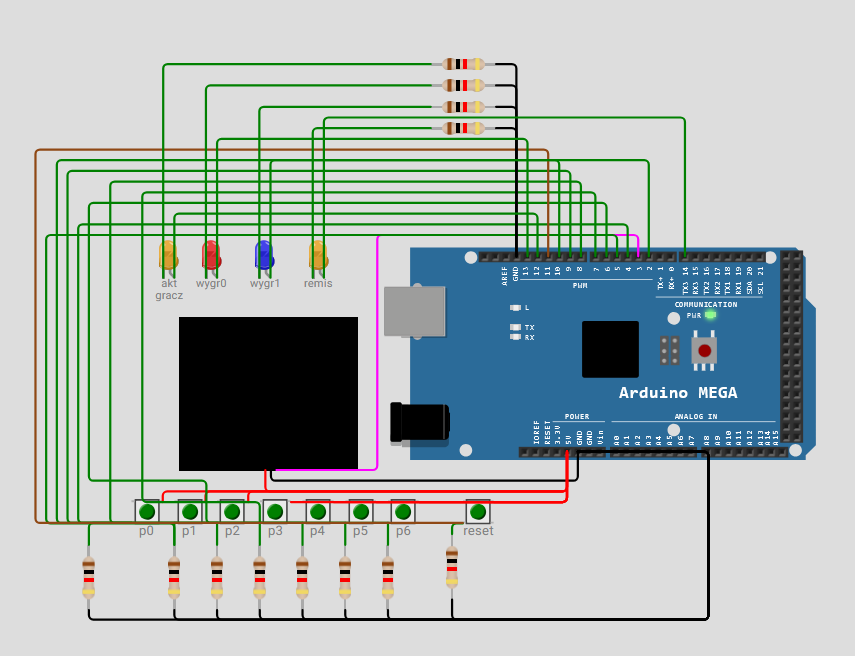
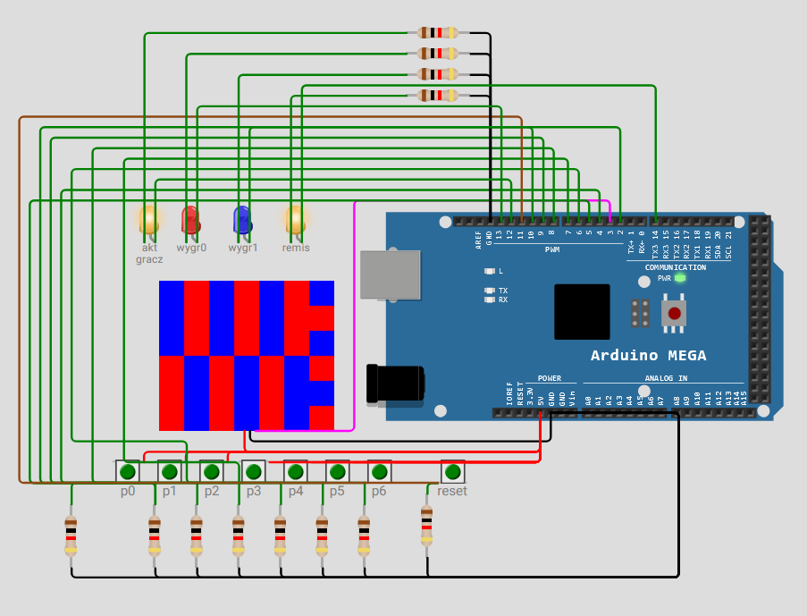
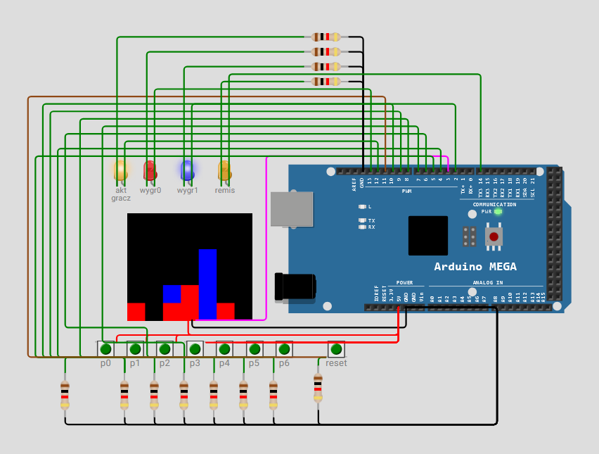

# Arduino Connect Four

Interaktywna implementacja klasycznej gry "Connect Four" oparta na platformie Arduino Mega oraz bibliotece FastLED. Projekt skupia się na implementacji logiki gry w systemie wbudowanym (embedded) z obsługą fizycznego interfejsu użytkownika.

## Demo (Wokwi)
Projekt jest w pełni funkcjonalny i dostępny do przetestowania w symulatorze:
👉 **[Zagraj w Connect Four na Wokwi](https://wokwi.com/projects/400315873139598337)**

## Opis techniczny
System zarządza stanem gry w czasie rzeczywistym, wykorzystując przyciski fizyczne jako kontrolery oraz matrycę LED jako wyświetlacz stanu rozgrywki.

**Kluczowe zagadnienia:**
* **Logika systemu:** Implementacja automatu skończonego (State Machine) do zarządzania stanami: tura gracza, weryfikacja wygranej, wykrywanie remisu.
* **Integracja sprzętowa:** Obsługa sygnałów wejściowych z przycisków (wraz z debouncingiem) oraz sterowanie matrycą diod LED przez bibliotekę FastLED.
* **Optymalizacja:** Wydajne zarządzanie pamięcią i stanem gry na architekturze Arduino Mega.

## Interfejs użytkownika
* **Wejście:** Fizyczne przyciski sterujące z układem rezystorów podciągających.
* **Wyjście:** Matryca LED sygnalizująca ruchy graczy (kolory), wynik końcowy oraz stan gry (ruch, wygrana, remis).

## Pliki projektu
* `sketch.ino`: Główny kod źródłowy (C++).
* `diagram.json`: Konfiguracja sprzętowa układu (Wokwi).
* `libraries.txt`: Zależności biblioteczne projektu.

## Galeria

